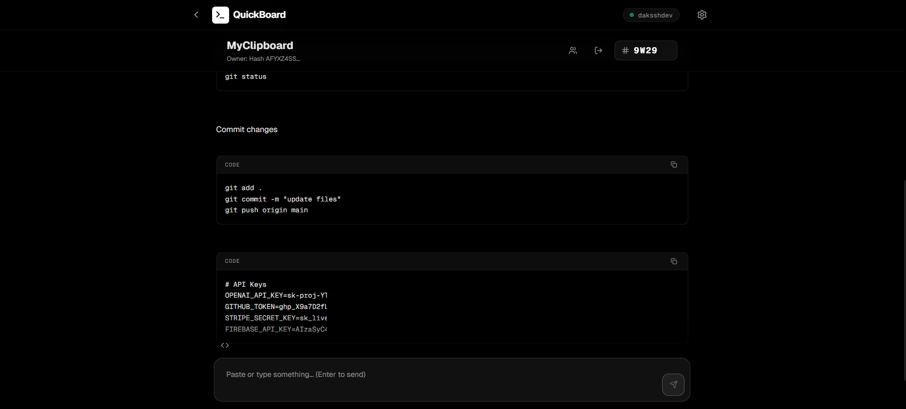

# Quick-Board

**Simple, secure real-time pastebin-like clipboard**

Quick-Board is a minimalist web application that lets you instantly share copied info across devices simply by sharing the board ID. Think of it like a simple messaging app but sharing copied info. No complex setup, no bloated features—just fast, secure clipboard syncing.





---

## ✨ Features

### ⬆️ **NEW: Files and image uploading feature!**
- Allows you to send any image or file to the clipboard
- uses cloudinary to do so

### 🎨 **Minimalist Design**
- Clean, distraction-free interface
- Responsive design that works on desktop and mobile

### 🚀 **Easy to Use**
- Create a clipboard board with any name
- Share the board ID with other users
- Start pasting—content syncs automatically

### 🌐 **Cross-Platform**
- Works in any modern web browser
- No app installation required

---

## 🚀 Getting Started

### Prerequisites
- Node.js (v14 or higher)
- A Firebase project ([Create one here](https://console.firebase.google.com/))

### Installation

1. **Clone the repository**
   ```bash
   git clone https://github.com/DaksshDev/QuickBoard.git
   cd QuickBoard
   ```

2. **Install dependencies**
   ```bash
   npm install
   ```

3. **Configure Firebase**
   - Navigate to client/src/lib/.firebase-template
   - Add your Firebase configuration:
     ```env
     REACT_APP_FIREBASE_API_KEY=your_api_key
     REACT_APP_FIREBASE_AUTH_DOMAIN=your_auth_domain
     REACT_APP_FIREBASE_PROJECT_ID=your_project_id
     REACT_APP_FIREBASE_STORAGE_BUCKET=your_storage_bucket
     REACT_APP_FIREBASE_MESSAGING_SENDER_ID=your_sender_id
     REACT_APP_FIREBASE_APP_ID=your_app_id
     ```
   - Rename the file to firebase.ts and save it!

4. **Set up Firebase Security Rules** (see below)

5. **Configure Cloudinary** (For file uploads)
   - Navigate to `client/src/lib/.cloudinary-template`
   - Add your Cloudinary API credentials:
     ```typescript
     export const CLOUDINARY_API_KEY = "your_api_key";
     export const CLOUDINARY_API_SECRET = "your_api_secret";
     export const CLOUDINARY_CLOUD_NAME = "your_cloud_name";
     ```
   - Rename the file to `cloudinary.ts` and save it!
   
6. **Run the development server**
   ```bash
   npm start
   ```

7. **Build for production**
   ```bash
   npm run build
   ```

---

## 🔐 Firebase Security Rules

**Important**: Copy these rules into your Firebase Console to ensure the app works correctly and stays secure.

### Cloud Firestore Rules

Navigate to **Firestore Database → Rules** in your Firebase Console and paste:

```javascript
rules_version = '2';
service cloud.firestore {
  match /databases/{database}/documents {
    // 1. Users collection
    match /users/{userId} {
      // Allow read to all authenticated users so they can see usernames/profiles
      allow read: if request.auth != null;
      // Allow write only to the owner
      allow write, update, delete: if request.auth != null && request.auth.uid == userId;
    }

    // 2. Clipboards collection (Metadata)
    match /clipboards/{boardId} {
      // Allow read to all authenticated users for search and validation
      allow read: if request.auth != null;
      // Allow creation if the board doesn't exist
      allow create: if request.auth != null && !exists(/databases/$(database)/documents/clipboards/$(boardId));
      // Only the owner can update (e.g. rename or sanitize) or delete
      allow update, delete: if request.auth != null && resource.data.createdByHash == request.auth.uid;
    }
  }
}
```

### Realtime Database Rules

Navigate to **Realtime Database → Rules** in your Firebase Console and paste:

```json
{
  "rules": {
    "clipboards": {
      "$boardId": {
        // Allow write if the board is being deleted by owner or created/updated by owner
        ".write": "auth != null && (!data.exists() || data.child('meta/createdByHash').val() == auth.uid)",
        ".read": "auth != null",
        "meta": {
          ".read": "auth != null",
          ".write": "auth != null && (!data.exists() || data.child('createdByHash').val() == auth.uid)"
        },
        "messages": {
          ".read": "auth != null",
          ".write": "auth != null"
        }
      }
    }
  }
}
```

---

## 🎯 How It Works

1. **Simple Security and Anonymity**: just enter a username and the app will create a hash of your username to reserve it, making it secure and anonymous.

2. **Real-Time Sync**: Messages are stored in Firebase Realtime Database, providing instant synchronization across all connected devices.

3. **Minimal Permissions**: Security rules ensure only board creators can modify board settings, while any authenticated user with the board name can read and write messages.

---

## 📖 Usage

1. **Sign in** Enter username and start sharing!
2. **Create or join** a clipboard board by entering a board name or creating a new one!
3. **Share** the board name with your other users
4. **Start pasting**—any text you add will show up instantly across all members of the board!

---

## 🤝 Contributing

Contributions are welcome! Feel free to:
- Report bugs
- Suggest new features
- Submit pull requests

Please keep the minimalist philosophy in mind—features should be essential and not add complexity.

---

If you liked this repo please give it a star!⭐